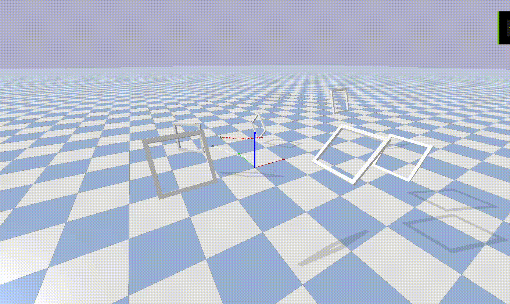

# SPIRAL: Self-Play Incremental Racing Algorithm for Learning in Multi-Drone Competitions

[](figs/racing.gif)

This repository contains the implementation of SPIRAL (Self-Play Incremental Racing Algorithm for Learning), a novel approach for training autonomous racing drones in competitive multi-agent environments. This work is associated with our conference paper:

> SPIRAL: Self-Play Incremental Racing Algorithm for Learning in Multi-Drone Competitions

## Overview

SPIRAL utilizes a multi-drone racing environment built on top of the Stable Baselines3 library. It allows for training agents using self-play and various reinforcement learning algorithms, enabling drones to learn competitive racing strategies in complex, dynamic environments.

## Key Features

- Multi-drone racing simulation environment
- Support for self-play training
- Implementation of various reinforcement learning algorithms (PPO, DDPG, SAC, TD3)
- Customizable racing tracks and difficulty levels

## Installation

To set up the environment:

1. Clone the repository:

git clone https://github.com/Onurion/SPIRAL-Racing-Algorithm

2. Navigate to the project directory:

cd Multi_Drone_Racing

3. Create a new conda environment using the provided `environment.yml` file:

conda env create -f environment.yml

4. Activate the newly created environment:

conda activate multi-drone-racing

## Training

To start training agents, use the `selfplay.py` script. You can customize the training process by modifying the following parameters:

- `NUM_DRONES`: Number of racing drones in the environment
- `NUM_DUMB_DRONES`: Number of opponent drones (with predefined behavior)
- `ALGO`: Reinforcement learning algorithm (PPO, DDPG, SAC, TD3)
- `TRACK`: Racing track selection (0 for easier, 1 for more challenging)

Note: Only PPO supports discrete actions. For DDPG, SAC, or TD3, set `discrete_action = False`.

Example usage:

```python
# In selfplay.py
NUM_DRONES = 2
NUM_DUMB_DRONES = 1
ALGO = "PPO"
TRACK = 1  # More challenging track

# Run the training script
python selfplay.py

```

## Environment Details

The envs folder contains the implementation of the multi-drone racing environment, including:

- Environment dynamics
- Reward functions
- Observation space definitions
This project extends the Stable Baselines3 library to support our self-play approach. For more information on Stable Baselines3, please refer to their official documentation.


## Citation

[Citation information will be added upon paper publication]
